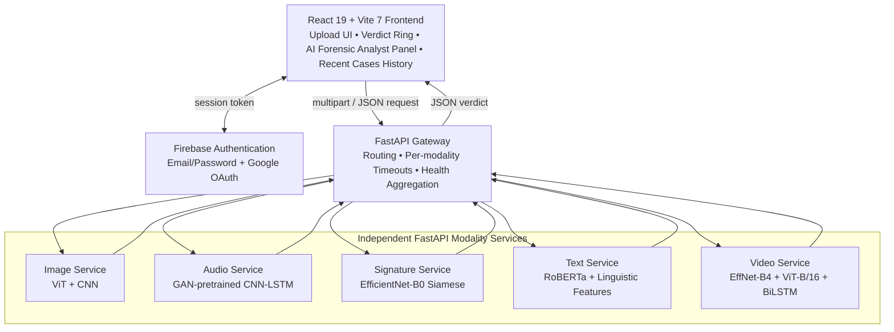
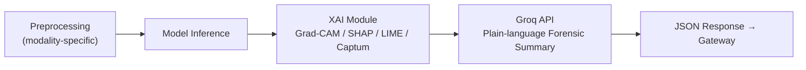

# MIRAJE - AI System for Detecting and Verifying Deepfake Multimedia Content

> *A mirage is something that appears real but is not. MIRAJE is the system that sees through it.*

MIRAJE is a unified, web-based deepfake detection platform that identifies synthetic media manipulation across **five modalities** (images, audio, video, text, and handwritten signatures) within a single forensic framework. Every verdict is paired with explainability output (Grad-CAM, SHAP, LIME, Integrated Gradients) and a plain-language forensic summary, so non-technical users such as journalists, legal professionals, and educators can understand *why* content was flagged, not just *that* it was flagged.

Two research papers describing this work were accepted and presented at **IEEE ICEENG 2026** (Military Technical College, Cairo).

---

## Team Members

| Name | Student ID | Program |
|---|---|---|
| Jana Ahmed | 202201853 | DSAI |
| Maysam Asser | 202200276 | DSAI |
| Rana Saad | 202200902 | DSAI |
| Riwan Ashraf | 202201726 | DSAI |

**Supervisor:** Dr. Mohamed Maher
**Institution:** Zewail City of Science and Technology - School of Computational Sciences and Artificial Intelligence (CSAI)

### Research Publications
- **Paper 1** - *Beyond Accuracy: Metaheuristic Driven Optimization of Interpretable Deepfake Detection with Vision Transformers* - IEEE ICEENG 2026
- **Paper 2** - *Audio Deepfake Detection Using GAN-Pretrained CNN-LSTM with Metaheuristic Hyperparameter Optimization* - IEEE ICEENG 2026

---

## Problem Statement

Deepfake content now spans multiple media types simultaneously, yet detection tools remain fragmented and modality-specific — a journalist verifying a video clip must consult separate, specialized tools for the audio, the text, and the image, each requiring technical expertise. Existing detectors are also largely black boxes: they issue a verdict with no explanation, making the result difficult to trust, reference in reporting, or contest in a legal context. Finally, no widely accessible, unified platform exists that delivers multi-modal deepfake detection to non-technical users with the transparency that responsible use demands. MIRAJE is built to close all three gaps simultaneously.

---

## Features

- **Five detection modalities** in one platform: image, audio, video, text, and handwritten signature forgery.
- **Hybrid ViT + CNN image detector** with FFT/DCT frequency-domain preprocessing, optimized via a nested Firefly + Simulated Annealing metaheuristic (92.30% accuracy, 80k-image test set).
- **GAN-pretrained CNN-LSTM audio detector** on Mel-spectrograms, optimized via the Bat Algorithm (94.44% accuracy, F1 = 0.9438).
- **Siamese EfficientNet-B0 signature verifier** with channel-attention on the feature difference, trained on CEDAR + GPDS-1150 + ICDAR 2011 (96.32% validation accuracy).
- **RoBERTa + linguistic-feature text detector**, evaluated under a strict topic-stratified split with zero topic overlap between train/val/test (test AUC 0.9909, F1 = 0.9783).
- **Dual-stream video detector** (EfficientNet-B4 spatial stream + BiLSTM temporal head, ViT-B/16 frequency stream, cross-attention fusion), evaluated across FaceForensics++, Celeb-DF v2, and DFDC (test AUC 0.929, EER 14.8%).
- **Explainable AI throughout**: Grad-CAM, SHAP, LIME (image), Integrated Gradients via Captum (text), per-frame Grad-CAM timelines (video), Mel-spectrogram visualization (audio), and channel-attention maps (signature).
- **Groq API explanation layer**: technical XAI output is synthesized into a plain-language forensic summary shown in an "AI Forensic Analyst" panel.
- **Firebase Authentication** with email/password and Google OAuth, plus a guest fallback mode for local development.
- **Recent Cases history table** tracking file name, modality, verdict, confidence, and timestamp per session.
- **Microservices backend** (FastAPI gateway + five independent services) enabling per-modality scaling and fault isolation.
- **Full experiment tracking** across all five modalities via Weights & Biases.

---

## System Architecture

MIRAJE uses a decoupled four-tier architecture: a React frontend, a FastAPI gateway, five independent modality services, and Firebase for authentication.



Each modality service follows the same internal pipeline before returning its result to the gateway:




Firebase Authentication sits outside this stack as a managed identity service. Weights & Biases sits outside the runtime path as an offline experiment-tracking system used during training.

The system was originally built as a single Flask monolith for rapid prototyping, then re-architected into the FastAPI microservices design above to allow independent scaling, fault isolation, and parallel development across modalities.

---

## Technology Stack

| Layer | Technologies |
|---|---|
| **Frontend** | React 19, Vite 7, Framer Motion, CSS3, Firebase JS SDK |
| **API Gateway** | FastAPI, Uvicorn, Python 3.9+ |
| **Modality Services** | FastAPI, Uvicorn, per-service model loading |
| **Machine Learning** | PyTorch, TensorFlow/Keras, HuggingFace Transformers, timm |
| **Audio Processing** | Librosa |
| **Computer Vision** | OpenCV, TorchVision, MTCNN (facenet-pytorch), Albumentations |
| **Explainable AI** | Grad-CAM, SHAP, LIME, Captum (Integrated Gradients) |
| **Natural-Language Explanation** | Groq API |
| **Authentication** | Firebase (Email/Password + Google OAuth) |
| **Experiment Tracking** | Weights & Biases (`deepfake-gp` team → `DeepfakeDetection_GraduationProject` project) |
| **Load Testing** | Locust |
| **Unit/Integration Testing** | Vitest v3.2.4, React Testing Library |
| **Version Control** | Git, GitHub |

---

## Environment Requirements

- **Python** 3.9 or later
- **Node.js** 18 or later
- **npm**
- **pip**
- GPU strongly recommended for backend inference (especially video and audio); training was performed on Google Colab Pro (V100/A100)
- Python packages: `fastapi`, `uvicorn`, `torch`, `torchvision`, `transformers`, `timm`, `tensorflow`, `librosa`, `opencv-python`, `Pillow`, `facenet-pytorch`, `albumentations`, `captum`, `shap`, `lime`
- A Firebase project (Authentication enabled for Email/Password and Google)
- A Groq API key (for the natural-language explanation layer)

---

## Setup Instructions

### 1. Clone the repository
```bash
git clone https://github.com/JanaAhmedHussien/MIRAJE-Detecting-DeepFake.git
cd MIRAJE-Detecting-DeepFake
```

### 2. Backend setup
```bash
cd backend
python -m venv venv

# Windows
venv\Scripts\activate
# macOS / Linux
source venv/bin/activate

pip install -r requirements.txt
```

### 3. Frontend setup
```bash
cd frontend
npm install
```

### 4. Environment variables
Create a `.env` file in the frontend directory (see `.env.example`):

```env
VITE_FIREBASE_API_KEY=your_api_key
VITE_FIREBASE_AUTH_DOMAIN=your_project.firebaseapp.com
VITE_FIREBASE_PROJECT_ID=your_project_id
VITE_FIREBASE_STORAGE_BUCKET=your_project.firebasestorage.app
VITE_FIREBASE_MESSAGING_SENDER_ID=your_sender_id
VITE_FIREBASE_APP_ID=your_app_id
```

Create a `.env` file in the backend directory for the Groq integration:

```env
GROQ_API_KEY=your_groq_api_key
```

Enable **Email/Password** and **Google** sign-in methods under Firebase Console → Authentication → Sign-in method.

### 5. Add model checkpoints
Trained model weights are not committed to the repository due to size. Place the following files in their respective service directories (contact the maintainers for the files, or retrain using the provided notebooks):

| Service | File | Approx. Size |
|---|---|---|
| Image | `image_module.pth` (ViT + CNN) | ~355 MB |
| Audio | `audio_model.keras` (GAN-pretrained CNN-LSTM) | ~2 MB |
| Signature | `signature_model.pth` (EfficientNet-B0 Siamese) | ~20 MB |
| Text | `text_model.pth` (RoBERTa + linguistic head) | ~480 MB |
| Video | `video_model.pth` (EfficientNet-B4 + ViT-B/16 + BiLSTM) | ~650 MB |

Each service will still start if its checkpoint is missing — it will simply return `503` on its prediction endpoint until the file is added.

---

## Deployment Instructions

### Start the backend (each service independently, then the gateway)
```bash
uvicorn image_service.main:app     --port 5001 &
uvicorn audio_service.main:app     --port 5002 &
uvicorn signature_service.main:app --port 5003 &
uvicorn text_service.main:app      --port 5004 &
uvicorn video_service.main:app     --port 5005 &
uvicorn gateway.main:app           --port 5000
```

### Start the frontend
```bash
cd frontend
npm run dev
```

Open `http://localhost:5173` in your browser. The frontend communicates with the gateway at `http://localhost:5000`.

### Per-service timeout configuration (enforced at the gateway)

| Service | Timeout |
|---|---|
| Image | 30 s |
| Signature | 30 s |
| Audio | 60 s |
| Text | 60 s |
| Video | 120 s |

For production deployment, each service is stateless and can be containerized and horizontally scaled independently behind a load balancer; only the gateway needs to be aware of service addresses.

---

## API Documentation

All endpoints are exposed through the gateway at `http://<gateway-host>:5000`.

### `GET /health`
Returns aggregated status of all five services.
```json
{
  "image": "ok",
  "audio": "ok",
  "signature": "ok",
  "text": "ok",
  "video": "ok"
}
```

### `POST /predict-image`
**Input:** multipart form field `image` (JPG/PNG)
```json
{
  "prediction": "FAKE",
  "fake_probability": 0.873,
  "real_probability": 0.127,
  "gradcam_heatmap": "<base64-encoded image>"
}
```

### `POST /predict-audio`
**Input:** multipart form field `audio` (WAV/MP3)
```json
{
  "prediction": "REAL",
  "fake_probability": 0.231,
  "real_probability": 0.769,
  "spectrogram": "<base64-encoded image>"
}
```

### `POST /predict-signature`
**Input:** multipart form field `signature` (JPG/PNG, two images for comparison)
```json
{
  "prediction": "FORGED",
  "fake_probability": 0.915,
  "real_probability": 0.085,
  "similarity_score": 0.0109
}
```

### `POST /predict-text`
**Input:** JSON body
```json
{ "text": "Paste the passage to analyze here." }
```
**Output:**
```json
{
  "prediction": "FAKE",
  "fake_probability": 0.981,
  "real_probability": 0.019,
  "token_importance": [["The", 0.02], ["results", 0.41], ["indicate", 0.38]],
  "sentence_scores": [0.91, 0.74, 0.95]
}
```

### `POST /predict-video`
**Input:** multipart form field `video` (MP4)
```json
{
  "prediction": "FAKE",
  "fake_probability": 0.567,
  "real_probability": 0.433,
  "frame_verdicts": [
    { "frame": 0, "fake_probability": 0.41 },
    { "frame": 1, "fake_probability": 0.58 }
  ]
}
```

Every endpoint returns at minimum a `prediction` field (`"REAL"`/`"FAKE"` or `"GENUINE"`/`"FORGED"` for signatures) and a `fake_probability` float between 0 and 1.

---

## Database & Data Persistence

MIRAJE does not use a traditional application database. There is no schema for uploaded media because uploads are intentionally **not persisted**:

- Files are processed entirely **in memory** by the relevant modality service and discarded immediately after the verdict is returned.
- **No user-uploaded content** is stored on disk, used for retraining, or shared with third parties.
- The only persisted user data is the **identity record managed by Firebase Authentication** (email address, OAuth provider ID, session tokens) — this is handled entirely by Firebase's own infrastructure and is not stored in any MIRAJE-controlled store.
- The **"Recent Cases" history table** (file name, modality, verdict, confidence, timestamp) lives only in frontend React state for the duration of the browser session and is cleared on reload; it is not written to a backend database.

This design choice was made deliberately for privacy and GDPR data-minimization reasons (see Ethics & Compliance below).

---

## Usage Guide

1. **Authenticate.** On first load, sign in with email/password or click "Continue with Google." New users can sign up via the "Create One" link.
2. **Analyze an image.** Open the Image tab, drag and drop a JPG/PNG, click **Initiate Analysis**. The verdict ring shows REAL/FAKE with a confidence percentage; the detailed panel shows the Grad-CAM heatmap and the AI Forensic Analyst's plain-language summary.
3. **Analyze audio.** Open the Audio tab, upload a WAV/MP3, click **Initiate Analysis**. Results include the verdict, confidence score, and Mel-spectrogram visualization.
4. **Verify a signature.** Open the Signature tab, upload the signature image(s), click **Initiate Analysis**. Results include the Genuine/Forged verdict, similarity score, cosine similarity, and Euclidean distance between embeddings.
5. **Analyze a video.** Open the Video tab, upload an MP4, click **Initiate Analysis**. The system samples frames, detects and aligns faces, and returns a frame-by-frame fake-probability timeline with Grad-CAM overlays alongside the overall verdict.
6. **Analyze text.** Paste or type a passage into the text input and click **Analyze**. Results include the Human/AI verdict and per-token, per-sentence attribution highlighting.
7. **Review history.** The Recent Cases table on the dashboard records every analysis from the current session — modality, verdict, confidence, and timestamp.

### Troubleshooting
- **Analyze button unresponsive:** confirm all five backend services and the gateway are running and reachable.
- **CORS errors in the browser console:** verify the `allow_origins` list in `gateway/main.py` matches your frontend origin.
- **Video analysis is very slow:** confirm the MTCNN/FFT preprocessing cache directory is populated; without it, face detection and frequency transforms are recomputed on every request.

---

## Testing

- **Unit/integration tests:** 48 tests across 4 component suites (`App.test.jsx`, `AuthContext.test.jsx`, `AuthPage.test.jsx`, `Miraje.test.jsx`) using Vitest v3.2.4 and React Testing Library — **100% pass rate**.
- **Integration testing:** verified via Postman and live frontend-backend calls; gateway health-aggregation tested for graceful reporting of individual service unavailability.
- **Load testing:** Locust-based concurrent-user simulation against the image, audio, and signature endpoints.
- **Model regression testing:** a 20-image regression suite covering PNG/JPG/RGBA inputs after the RGBA-to-RGB preprocessing fix.

Run the frontend test suite:
```bash
cd frontend
npm run test
```

---

## Screenshots / Demo

```markdown

```
---

## Project Structure

```
MIRAJE-Detecting-DeepFake/
├── backend/
│   ├── gateway/                 # FastAPI gateway: routing, timeouts, health aggregation
│   ├── image_service/           # ViT + CNN inference service
│   ├── audio_service/           # GAN-pretrained CNN-LSTM inference service
│   ├── signature_service/       # EfficientNet-B0 Siamese inference service
│   ├── text_service/            # RoBERTa + linguistic-feature inference service
│   ├── video_service/           # EfficientNet-B4 + ViT-B/16 + BiLSTM inference service
│   ├── xai/                     # Grad-CAM, SHAP, LIME, Captum helpers
│   ├── groq_client.py           # Groq API integration for plain-language summaries
│   └── requirements.txt
├── frontend/
│   ├── src/
│   │   ├── App.jsx
│   │   ├── AuthPage.jsx
│   │   ├── AuthContext.jsx
│   │   ├── firebase.js
│   │   └── Miraje.css
│   ├── index.html
│   ├── vite.config.js
│   └── package.json
├── docs/
│   └── screenshots/
└── README.md
```

Active development was organized across nine branches by feature/service area: `main`, `FE-redesign`, `Text-service-v3`, `feature/Text-service-v2`, `feature/audio-signature-service`, `feature/image-service`, `feature/video-service`, `frontend-redesign`, `refactor/backend-architecture`.

---

## Ethics & Compliance

- **Privacy:** uploaded media is processed in memory only and never persisted (see Database section above).
- **Bias mitigation:** training draws on multiple, demographically varied public datasets per modality; verdicts are presented as probabilistic assessments, not absolute claims.
- **Responsible framing:** results are positioned as decision-support for human reviewers, not authoritative rulings.
- Standards referenced: OWASP secure-development practices, GDPR data-minimization principles, IEEE software engineering practices (version control, code review via pull request, systematic testing).

---

## Contributing

1. Fork the repository
2. Create a feature branch: `git checkout -b feature/your-feature`
3. Commit your changes
4. Push and open a pull request against `main`

## License

MIT

## Acknowledgments

Supervised by Dr. Mohamed Maher, School of Computational Sciences and Artificial Intelligence, Zewail City of Science and Technology. With thanks to Dr. Doaa Shawky, Dr. Yousry Abdul Azeem, Dr. Ahmed Abdelsamea, Dr. Khaled Moustafa, Dr. Mayada Hadhoud, and Dr. Mohamed Ghalwash for guidance throughout our journey, and to the organizers and reviewers of IEEE ICEENG 2026 for accepting and featuring this work.
